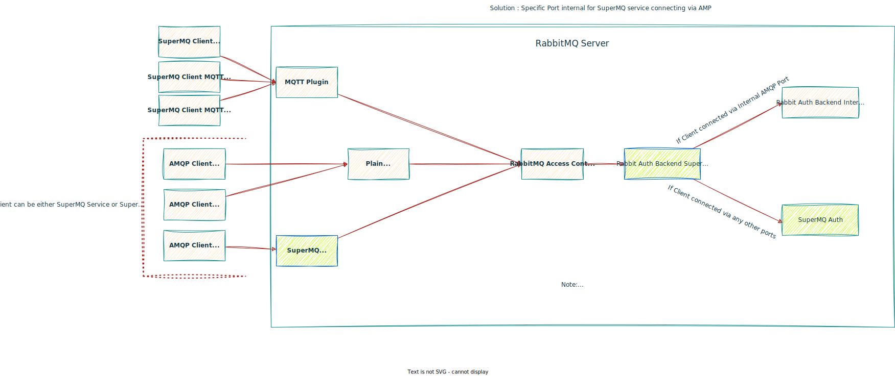

# SuperMQ Rabbit Plugins

This repository contains two RabbitMQ plugins to integrate **SuperMQ authentication**:

1. **`rabbitmq_auth_backend_supermq`**

   * Implements the backend authentication and authorization logic for SuperMQ users and clients.
   * Allows RabbitMQ to validate user credentials and permissions via the SuperMQ system.

2. **`rabbitmq_auth_mechanism_supermq_mtls`**

   * Adds a custom SASL mechanism for mTLS authentication with SuperMQ clients.
   * Enables RabbitMQ to perform mutual TLS authentication with SuperMQ clients using client certificates.

Together, these plugins enable **secure integration of the SuperMQ authentication system with RabbitMQ**, supporting both username/password and mTLS client authentication.

## Architecture Diagram



---

Do you want me to also add a **one-line “purpose” description** for the top of the README for a quick glance?


# Project Setup and Running Instructions

## Step 1: Install Dependencies

Make sure the following are installed on your system:

* **Erlang**
* **Elixir**
* **Elixir Language Server (elp extension)** in your code editor
* Ensure both **Erlang** and **Elixir** are available in your system `PATH`.

---

## Step 2: Build the Project

```bash
make build
```

---

## Step 3: Run the Project

```bash
make run
```

---

## Step 4: Generate Certificates

Before running RabbitMQ with TLS/mTLS, generate the required certificates.

1. **Switch to the certificates directory:**

```bash
cd docker/certs
```

2. **Generate CA and server certificates:**

```bash
./genRootAndServerCerts.sh
```

This script will generate the following files in `docker/certs/`:

* `ca.key` → CA private key
* `ca.crt` → Self-signed CA certificate
* `server.key` → Server private key
* `server.csr` → Server certificate signing request
* `server.crt` → Server certificate signed by the CA

3. **Generate client certificates (internal or SuperMQ client):**

```bash
# Internal client certificate
./genClientCerts.sh --internal

# SuperMQ client certificate
./genClientCerts.sh --supermq-client <client_id>
```

* `--internal` → Generates `client.key`, `client.csr`, `client.crt` with CN=`internal`
* `--supermq-client <id>` → Generates `supermq-client.key`, `supermq-client.csr`, `supermq-client.crt` with CN=`<id>`

> **Note:** Replace `<client_id>` with the actual SuperMQ client ID.

---

## Step 5: Testing the Broker

There are two test scripts located in the `test/` directory:

1. **Internal authentication test:**

```bash
python test/internal.py
```

2. **SuperMQ client authentication test:**

```bash
python test/super_clients.py
```

> ⚠️ **Important:** Before running `test/super_clients.py`, update the following variables with your generated SuperMQ client credentials:

```python
SUPERMQ_CLIENT_ID="<SUPERMQ_CLIENT_ID>" ## Replace here with SuperMQ Client ID
SUPERMQ_CLIENT_KEY="<SUPERMQ_CLIENT_KEY>" ## Replace here with SuperMQ Client Key
```

---

## Notes

* Always switch to the `docker/certs` directory when generating or managing certificates.
* The CA certificate (`ca.crt`) should be trusted by any clients connecting to RabbitMQ.
* Internal and SuperMQ client certificates are required for TLS/mTLS authentication with the broker.
